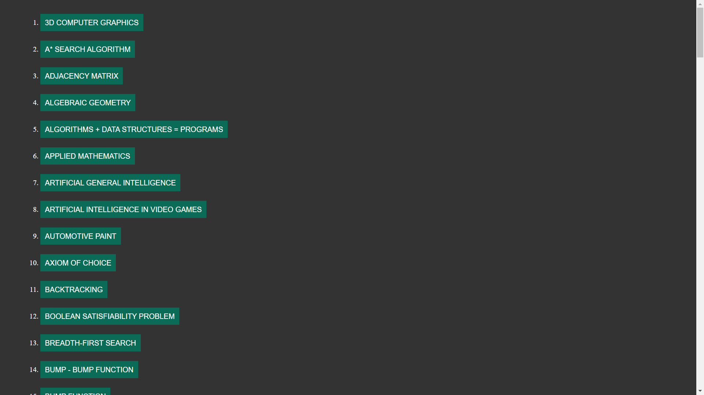

# wikisources
articles from wikipedia
## visit here: https://grzesiekmq.github.io/wikisources/index.html  
  

list of articles:
  
    

 3D computer graphics - Wikipedia  
A* search algorithm - Wikipedia  
AI-complete - Wikipedia  
Adjacency matrix - Wikipedia  
Algebraic geometry - Wikipedia  
Algorithms + Data Structures = Programs - Wikipedia  
Applied mathematics - Wikipedia  
Applied science - Wikipedia  
Artificial general intelligence - Wikipedia  
Artificial intelligence in video games - Wikipedia  
Automated planning and scheduling - Wikipedia  
Automated reasoning - Wikipedia  
Automotive paint - Wikipedia  
Axiom of choice - Wikipedia  
Backtracking - Wikipedia  
Bag-of-words model - Wikipedia  
Bag-of-words model in computer vision - Wikipedia  
Big data - Wikipedia  
Bit field - Wikipedia  
Bit manipulation - Wikipedia  
Blocks world - Wikipedia  
Boolean satisfiability problem - Wikipedia  
Breadth-first search - Wikipedia  
Bump - Bump function - Wikipedia  
Bump function - Wikipedia  
Business informatics - Wikipedia  
Business intelligence - Wikipedia  
Bézout's theorem - Wikipedia  
Cartesian coordinate system - Wikipedia  
Category theory - Wikipedia  
Category:Computational fields of study - Wikipedia  
Category:Computing - Wikipedia  
Category:Computing-related lists - Wikipedia  
Category:Digital geometry - Wikipedia  
Category:Mathematical chess problems - Wikipedia  
Category:Metric geometry - Wikipedia  
Category:Natural language and computing - Wikipedia  
Category:Norms (mathematics) - Wikipedia  
Chatbot - Wikipedia  
Clique (graph theory) - Wikipedia  
Closure (topology) - Wikipedia  
Cloud computing - Wikipedia  
Combinatorial optimization - Wikipedia  
Complete bipartite graph - Wikipedia  
Complete graph - Wikipedia  
Component (graph theory) - Wikipedia  
Compression ratio - Wikipedia  
Computational economics - Wikipedia  
Computational finance - Wikipedia  
Computational intelligence - Wikipedia  
Computational linguistics - Wikipedia  
Computational physics - Wikipedia  
Computer graphics (computer science) - Wikipedia  
Computer security - Wikipedia  
Computer vision - Wikipedia  
Computing - Wikipedia  
Configuration file - Wikipedia  
Connectivity (graph theory) - Wikipedia  
Constraint satisfaction problem - Wikipedia  
Cotangent bundle - Wikipedia  
Cryptocurrency - Wikipedia  
DALL-E - Wikipedia  
Dark web - Wikipedia  
Data buffer - Wikipedia  
Data compression ratio - Wikipedia  
Data mining - Wikipedia  
Data structure - Wikipedia  
Data warehouse - Wikipedia  
Decision support system - Wikipedia  
Decision theory - Wikipedia  
Deconvolution - Wikipedia  
Deep web - Wikipedia  
Diffeomorphism - Wikipedia  
Differentiable manifold - Wikipedia  
Diffusion model - Wikipedia  
Digital geometry - Wikipedia  
Disjoint sets - Wikipedia  
Distributed computing - Wikipedia  
Document AI - Wikipedia  
Document classification - Wikipedia  
Dot product - Wikipedia  
Double factorial - Wikipedia  
Dual space - Wikipedia  
Edmonds–Karp algorithm - Wikipedia  
Eight queens puzzle - Wikipedia  
Elementary function - Wikipedia  
Email filtering - Wikipedia  
Ensemble forecasting - Wikipedia  
Enterprise resource planning - Wikipedia  
Enterprise software - Wikipedia  
Euclidean distance - Wikipedia  
Euler tour technique - Wikipedia  
Expert system - Wikipedia  
Fintech - Wikipedia  
Flow network - Wikipedia  
Floyd–Warshall algorithm - Wikipedia  
Fuzzy logic - Wikipedia  
Fuzzy set - Wikipedia  
GOFAI - Wikipedia  
GPT-2 - Wikipedia  
Geometric algebra - Wikipedia  
Glossary of artificial intelligence - Wikipedia  
Glossary of computer graphics - Wikipedia  
Gödel, Escher, Bach - Wikipedia  
Help:Category - Wikipedia  
Hidden Markov model - Wikipedia  
Hill climbing - Wikipedia  
Homeomorphism - Wikipedia  
In-place algorithm - Wikipedia  
Independent set (graph theory) - Wikipedia  
Infimum and supremum - Wikipedia  
Information extraction - Wikipedia  
Information retrieval - Wikipedia  
Information system - Wikipedia  
Intelligent agent - Wikipedia  
Internet Archive - Wikipedia  
Inverse problem - Wikipedia  
Involution (mathematics) - Wikipedia  
Isosurface - Wikipedia  
Jacobi eigenvalue algorithm - Wikipedia  
Keep away - Wikipedia  
Kleene star - Wikipedia  
Kleene's recursion theorem - Wikipedia  
Knowledge representation and reasoning - Wikipedia  
Konami Code - Wikipedia  
L-infinity - Wikipedia  
LU decomposition - Wikipedia  
Laplacian matrix - Wikipedia  
Lasso (statistics) - Wikipedia  
Latent Dirichlet allocation - Wikipedia  
Latent semantic analysis - Wikipedia  
Lebesgue covering dimension - Wikipedia  
Lemmatisation - Wikipedia  
Level set - Wikipedia  
Level-set method - Wikipedia  
Line (geometry) - Wikipedia  
Linear programming - Wikipedia  
List of algorithms - Wikipedia  
List of graphical methods - Wikipedia  
List of lists of lists - Wikipedia  
Lists of encyclopedias - Wikipedia  
Lists of islands - Wikipedia  
Lists of mathematics topics - Wikipedia  
Lists of video game companies - Wikipedia  
Local search (optimization) - Wikipedia  
Logarithmic scale - Wikipedia  
Lp space - Wikipedia  
Manhattan distance - Taxicab geometry - Wikipedia  
Map (mathematics) - Wikipedia  
Marching cubes - Wikipedia  
Markov chain Monte Carlo - Wikipedia  
Mask (computing) - Wikipedia  
Mathematical chess problem - Wikipedia  
Mathematical economics - Wikipedia  
Mathematical finance - Wikipedia  
Maximal and minimal elements - Wikipedia  
Metaballs - Wikipedia  
Monkey and banana problem - Wikipedia  
Monte Carlo integration - Wikipedia  
Monte Carlo method - Wikipedia  
Morphism - Wikipedia  
Multi-agent planning - Wikipedia  
Multi-agent system - Wikipedia  
Multidisciplinary design optimization - Wikipedia  
Multiset - Wikipedia  
NaN - Wikipedia  
Named entity - Wikipedia  
Natural language generation - Wikipedia  
Natural language processing - Wikipedia  
Natural-language understanding - Wikipedia  
Natural-language user interface - Wikipedia  
Neighborhood illust1 - Neighbourhood (mathematics) - Wikipedia  
Neighbourhood (mathematics) - Wikipedia  
Newton's method - Wikipedia  
Nipson anomemata me monan opsin - Wikipedia  
Null graph - Wikipedia  
Numerical analysis - Wikipedia  
Numerical linear algebra - Wikipedia  
Numerical weather prediction - Wikipedia  
One-way compression function - Wikipedia  
Onion routing - Wikipedia  
Ontology (information science) - Wikipedia  
Operations research - Wikipedia  
Optical character recognition - Wikipedia  
PageRank - Wikipedia  
Palindrome - Wikipedia  
Parallel computing - Wikipedia  
Parsing - Wikipedia  
Pathfinding - Wikipedia  
Pattern recognition - Wikipedia  
Peer-to-peer - Wikipedia  
Petri net - Wikipedia  
Probabilistic context-free grammar - Wikipedia  
Procedural generation - Wikipedia  
Pure mathematics - Wikipedia  
Question answering - Wikipedia  
RSA (cryptosystem) - Wikipedia  
Residual neural network - Wikipedia  
Round-robin tournament - Wikipedia  
Run-length encoding - Wikipedia  
Runge–Kutta methods - Wikipedia  
SHA-2 - Wikipedia  
Sample mean and covariance - Wikipedia  
Scripting language - Wikipedia  
Search engine - Wikipedia  
Search engine optimization - Wikipedia  
Semantic Web - Wikipedia  
Sentiment analysis - Wikipedia  
Seq2seq - Wikipedia  
Social media mining - Wikipedia  
Stable Diffusion - Wikipedia  
Star (graph theory) - Wikipedia  
Star network - Wikipedia  
Statistical physics - Wikipedia  
Stemming - Wikipedia  
String (computer science) - Wikipedia  
Subnetwork - Wikipedia  
Substring - Wikipedia  
Superpermutation - Wikipedia  
Supply chain management - Wikipedia  
Symbolic artificial intelligence - Wikipedia  
Synthetic biology - Wikipedia  
Systems theory - Wikipedia  
Talk:Homeomorphism - Wikipedia  
Taxicab geometry - Wikipedia  
Telephone number (mathematics) - Wikipedia  
Text mining - Wikipedia  
Text-to-image model - Wikipedia  
Texture mapping - Wikipedia  
The Art of Computer Programming - Wikipedia  
Topic model - Wikipedia  
Topology - Wikipedia  
Tor (network) - Wikipedia  
Tournament (graph theory) - Wikipedia  
Toy problem - Wikipedia  
Tropical geometry - Wikipedia  
View source for Lp space - Wikipedia  
Virtual organization - Wikipedia  
Wayback Machine - Wikipedia  
Weak supervision - Wikipedia  
Webgraph - Wikipedia  
Word (computer architecture) - Wikipedia  
WordNet - Wikipedia  
YAML - Wikipedia  
n-gram - Wikipedia  
tf–idf - Wikipedia
